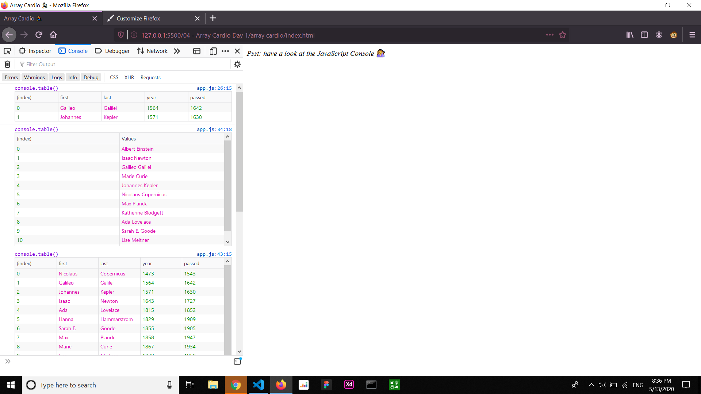

# Array-Cardio
This was a fun exercise to practice on Array Methods and how they can be used in different situations. 
The methods include:
 
<ul>
  <li> Filter</li>
  <li> Sort</li>
  <li> Reduce</li>
  <li> Mpa</li>
  </ul>

 
 

